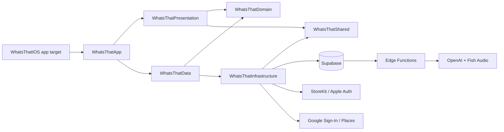

# What's That? AI Audio Guide

<p align="center">
  
</p>

<p align="center">
  <strong>A native iOS travel companion that turns photos into streamed, personalized AI audio guides.</strong>
</p>

<p align="center">
  <a href="https://apps.apple.com/us/app/whats-that-ai-audio-guide/id6756409506"><strong>View on the App Store</strong></a>
  &middot;
  <a href="#engineering-highlights">Engineering Highlights</a>
  &middot;
  <a href="#architecture">Architecture</a>
  &middot;
  <a href="#security-architecture">Security Architecture</a>
</p>

<p align="center">
  <a href="https://apps.apple.com/us/app/whats-that-ai-audio-guide/id6756409506">
    
  </a>
  
  
  
  
</p>

<p align="center">
  
  
  
  
</p>

## Overview

What's That? is built for travelers and curious people who want context without stopping to search. Take or upload a photo of a landmark, artwork, street food, sign, artifact, or place, and the app streams back a concise explanation of what you are seeing and why it matters. The result can be read immediately, saved to a personal discovery library, or played as an AI-generated audio guide while exploring.

This repository is the native iOS product and backend surface behind the App Store app. It is intentionally structured as a portfolio-grade codebase: production app shell, modular Swift package, Supabase Edge Functions, database migrations, StoreKit credit flow, and focused test coverage.

## Product Flow

| Step | User experience | Engineering surface |
| --- | --- | --- |
| Capture | Take a camera photo or import from the library | SwiftUI flow coordinator, permissions, image encoding, photo-library handling |
| Context | Add location, EXIF fallback, and nearby-place hints | Core Location services, Google Places-backed Supabase Edge Function, local caching |
| Analysis | Watch the explanation stream in real time | Server-sent events, OpenAI-backed Edge Function, cancellation and error handling |
| Audio | Generate and play a narrated guide | Fish Audio TTS Edge Function, Supabase Storage, local audio cache, queue state |
| Library | Browse past discoveries and revisit details | Cursor pagination, signed image URLs, Markdown rendering, animated detail transition |
| Credits | Buy credits for analysis and audio generation | StoreKit 2, receipt validation, idempotent Supabase credit transactions |

## Engineering Highlights

- **Shipped native iOS product**: SwiftUI-first app available on the App Store, with real authentication, purchases, backend storage, and server functions.
- **Modular architecture**: A minimal Xcode app target composes feature code from a Swift Package split into app, presentation, domain, data, infrastructure, and shared modules.
- **Streaming AI pipeline**: The `ask-ai-v7` Supabase Edge Function streams model output to the app, while the SwiftUI view model manages progress, cancellation, completion, and feed hydration.
- **Production audio system**: Voiceover requests, polling, caching, playback progress, speed selection, autoplay, queue state, and mini-player visibility are modeled separately so playback can move across screens.
- **Commerce and credits**: StoreKit 2 purchase handling is paired with server-side receipt validation and Supabase RPCs for credit grants, consumption, refunds, and idempotency.
- **Security hardening**: Authenticated Edge Functions, RLS, service-role-only mutations, rate limiting, pinned Postgres function search paths, and data minimization are treated as product architecture rather than afterthoughts.
- **Backend ownership**: The repo includes Edge Functions for analysis, voiceover generation, nearby places, receipt validation, sharing, export, and account deletion, plus versioned database migrations.
- **Testable by design**: Domain use cases, stores, parsers, presentation view models, cache behavior, and infrastructure adapters have focused XCTest coverage through protocol boundaries and stubs.

## Architecture

The app uses a workspace plus Swift Package structure so the Xcode target stays thin and most code remains independently testable.

```text
native/
  WhatsThatIOS.xcworkspace          # Open this in Xcode
  WhatsThatIOS/                     # App shell, assets, plist, test plan
  WhatsThatIOSPackage/
    Sources/
      WhatsThatApp/                 # App entry points and dependency injection
      WhatsThatPresentation/        # SwiftUI views, view models, coordinators
      WhatsThatDomain/              # UI-free models, use cases, protocols
      WhatsThatData/                # Repository implementations
      WhatsThatInfrastructure/      # Supabase, auth, StoreKit, camera, location, notifications
      WhatsThatShared/              # Branding, config, formatting, caching, appearance
    Tests/                          # Module-oriented XCTest targets
supabase/
  functions/                        # Deno Edge Functions
  migrations/                       # Date-versioned Postgres migrations
marketing/
  appstore/                         # App Store screenshots and preview assets
```



## Security Architecture

Security-sensitive work is captured in the database, Edge Function, and iOS integration layers:

- **Authenticated server boundary**: `ask-ai-v7`, `generate-voiceover`, `nearby-places`, and `validate-receipt` are JWT-verified Supabase Edge Functions. The app calls them as an authenticated user; privileged writes happen server-side.
- **Least-privilege data access**: RLS protects user-owned tables and storage paths. Direct client inserts into `public.discoveries` were removed so new discoveries are created only through the analysis Edge Function.
- **Hardened Postgres functions**: Security-definer RPCs pin `search_path` and use qualified object references to avoid search-path hijacking and privilege confusion.
- **Service-role-only mutations**: Credit-granting, credit consumption, refunds, voiceover creation, and receipt-backed purchase flows are routed through backend-only RPCs instead of exposing mutation paths to normal authenticated clients.
- **Free-credit abuse prevention**: Initial credit grants are tracked by hashed identifiers across normalized email, OAuth provider subject, and a Keychain-backed device ID. If a user deletes an account and signs up again with a known email, provider identity, or device, the backend creates the account credit row but does not issue another free-credit grant.
- **Receipt and credit integrity**: StoreKit 2 transactions are validated by `validate-receipt`; processed purchases are idempotent by store transaction ID, and raw Apple receipt storage was removed for data minimization.
- **Rate limiting**: Edge Function calls use server-side rate-limit tables/RPCs keyed by user and function, with atomic counters for concurrent requests.
- **Privacy and deletion**: Account deletion cascades through user data and storage cleanup, including discovery images and generated voiceover files.
- **Public sharing by design**: Shared discoveries use unguessable share tokens and constrained CORS while keeping links intentionally public until the user deletes the discovery.

## Where To Look

- [`DiscoveryCreationFlowViewModel.swift`](native/WhatsThatIOSPackage/Sources/WhatsThatPresentation/DiscoveryCreationFlowViewModel.swift) - camera/upload state machine and streaming lifecycle.
- [`SupabaseDiscoveryAnalysisClient.swift`](native/WhatsThatIOSPackage/Sources/WhatsThatInfrastructure/Services/Analysis/SupabaseDiscoveryAnalysisClient.swift) - analysis request integration.
- [`VoiceoverPlaybackController.swift`](native/WhatsThatIOSPackage/Sources/WhatsThatPresentation/Shared/Controllers/VoiceoverPlaybackController.swift) - audio guide playback, cache, progress, and queue behavior.
- [`StoreKitCreditsStore.swift`](native/WhatsThatIOSPackage/Sources/WhatsThatInfrastructure/Services/Credits/StoreKitCreditsStore.swift) - StoreKit 2 product loading and purchase flow.
- [`AppDependencyContainer.swift`](native/WhatsThatIOSPackage/Sources/WhatsThatApp/DependencyInjection/AppDependencyContainer.swift) - production dependency graph.
- [`ask-ai-v7`](supabase/functions/ask-ai-v7/index.ts) - streaming photo analysis Edge Function.
- [`generate-voiceover`](supabase/functions/generate-voiceover/index.ts) - TTS generation, storage, retries, and refunds.
- [`validate-receipt`](supabase/functions/validate-receipt/index.ts) - StoreKit transaction validation.
- [`supabase/config.toml`](supabase/config.toml) - Edge Function JWT verification and exposed schema configuration.
- [`supabase/migrations`](supabase/migrations) - RLS, RPC hardening, rate limiting, credit integrity, and deletion cascades.

## Tech Stack

| Area | Tools |
| --- | --- |
| iOS | Swift 5.10, SwiftUI, structured concurrency, iOS 17+, Xcode workspace |
| Architecture | Swift Package Manager, dependency injection, protocol-oriented boundaries |
| Backend | Supabase Auth, Postgres, Storage, RPCs, Edge Functions, Deno |
| AI and audio | OpenAI API streaming, Fish Audio TTS, SSE, local asset caching |
| Commerce | StoreKit 2, App Store receipt validation, credit ledger migrations |
| UI support | MarkdownUI, Nuke, custom brand components, adaptive light/dark appearance |
| Testing | XCTest, XCUITest scaffold, stubs for offline/domain coverage |

## App Store

Download the live app here: [What's That? AI Audio Guide](https://apps.apple.com/us/app/whats-that-ai-audio-guide/id6756409506).
